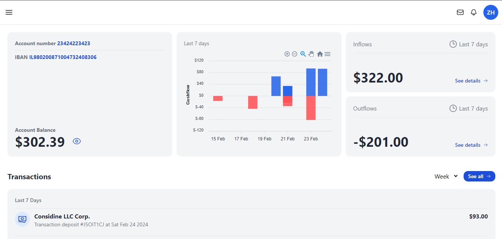
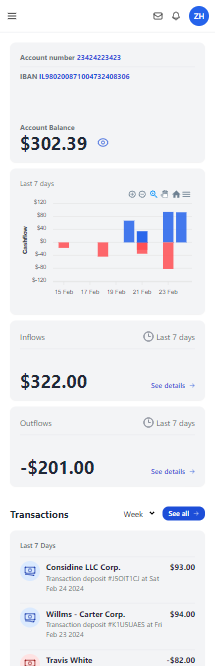

# Bank App

Aplikasi Keuangan yang mencakup pemasukan, pengeluaran, transaksi.

## Daftar Isi

- [Project Setup](#project-setup)
- [Overview](#overview)
  - [Penjelasan Project](#the-challenge)
  - [Screenshot](#screenshot)
- [Proses](#proses)
  - [Stack yang digunakan](#stack-yang-digunakan)
  - [Resources](#resources)
- [Author](#author)

## Project Setup

```sh
npm install
npm install -g json-server
```

### Run Backend with JSON Server

```sh
json-server --watch src/data/data.json --port 8000
```

### Compile and Hot-Reload for Development

```sh
npm run dev
```

\*Cek user username dan password di src/data/data.json atau http://localhost:8000/users setelah local backend server dijalankan

## Overview

### Penjelasan Project

Pada project ini saya membangun sebuah Aplikasi Keuangan yang mencakup pemasukan, pengeluaran, transaksi. Credit design by [Matteo Della Chiesa](https://dribbble.com/MatteoDellaChiesa).

Objektif pada project ini:

- Bersifat responsive
- Terdapat skenario gagal yang nantinya dapat memunculkan notif
- Terdapat grafik pemasukan & pengeluaran
- Terdapat mekanisme filter harian, bulanan hingga tahunan
- Terdapat mekanisme pin (saat melakukan transaksi)

### Screenshot

**Tampilan Desktop**


**Tampilan Mobile**<br>


## Proses

### Stack yang digunakan

- [Vue](https://vuejs.org/)
- [Tailwind CSS](https://tailwindcss.com/)
- [Apexcharts](https://apexcharts.com/)
- [VueUse](https://vueuse.org/)
- [FakerJs](https://fakerjs.dev/)
- Mobile-first workflow

## Author

- Twitter - [@abimhrdnt](https://www.twitter.com/abimhrdnt)
- Frontend Mentor - [@abimh66](https://www.frontendmentor.io/profile/abimh66)
- Codewars - [@abimh66](https://www.codewars.com/users/abimh66)
